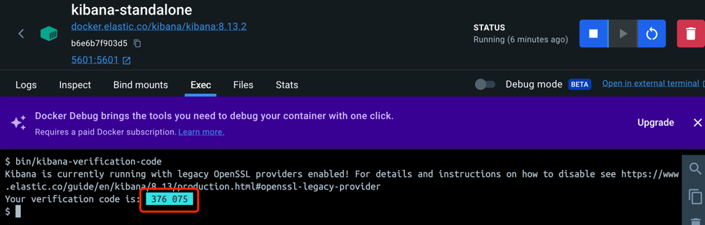

# Steps for run es and kibana 8.13.2 with docker：
**Official reference manual**：https://www.elastic.co/guide/en/elasticsearch/reference/current/docker.html

1. docker run --name es-standalone **--restart=always** --net elastic -p 9200:9200 -it **-m 4GB** docker.elastic.co/elasticsearch/elasticsearch:8.13.2
2. docker exec -it es-standalone /usr/share/elasticsearch/bin/elasticsearch-reset-password -u elastic
3. export ELASTIC_PASSWORD="your_password"（your_password是上述第2步的结果）
4. Copy the http_ca.crt SSL certificate from the container to your local machine：
docker cp es-standalone:/usr/share/elasticsearch/config/certs/http_ca.crt .
5. Test es running: 
curl --cacert http_ca.crt -u elastic:$ELASTIC_PASSWORD https://localhost:9200
6. docker run --name kibana-standalone --restart=always --net elastic -p 5601:5601 docker.elastic.co/kibana/kibana:8.13.2
7. Generate an enrollment token to use when logging into the kibana console
docker exec -it es-standalone /usr/share/elasticsearch/bin/elasticsearch-create-enrollment-token -s kibana
8. Access kibana console address: http://127.0.0.1:5601/

# es-standalone & kibana-standalone information

elasticsearch user / password：elastic / kncD5l5Fqb++qHVZez-N

http_ca.crt SSL certificate path:
/Users/lc_dream_real/Study/Github/elasticsearch-java/http_ca.crt

access kibana:http://127.0.0.1:5601/

kibana enrollment token：eyJ2ZXIiOiI4LjEzLjIiLCJhZHIiOlsiMTcyLjE5LjAuMjo5MjAwIl0sImZnciI6IjhlMjBhYWI0NWVlNGUwODJhZGZiZGVjZjc0Y2M3OTA3ODI4ZjA3MTM4MTU4MGU0MWFiOGE1NDljNTIwNTJiMzUiLCJrZXkiOiJWSWJ4OVk0QnA3cms2dVE0Ri16QjpfYXVzSHhLbFMwNlNMcTNNOWxOb2hRIn0=

kibana get verification-code：bin/kibana-verification-code

