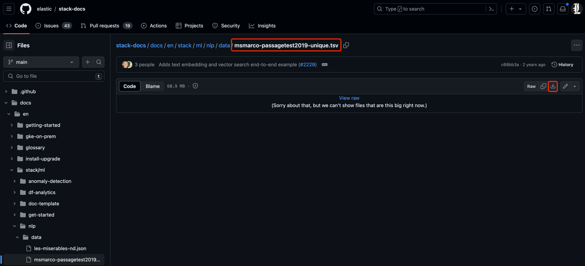
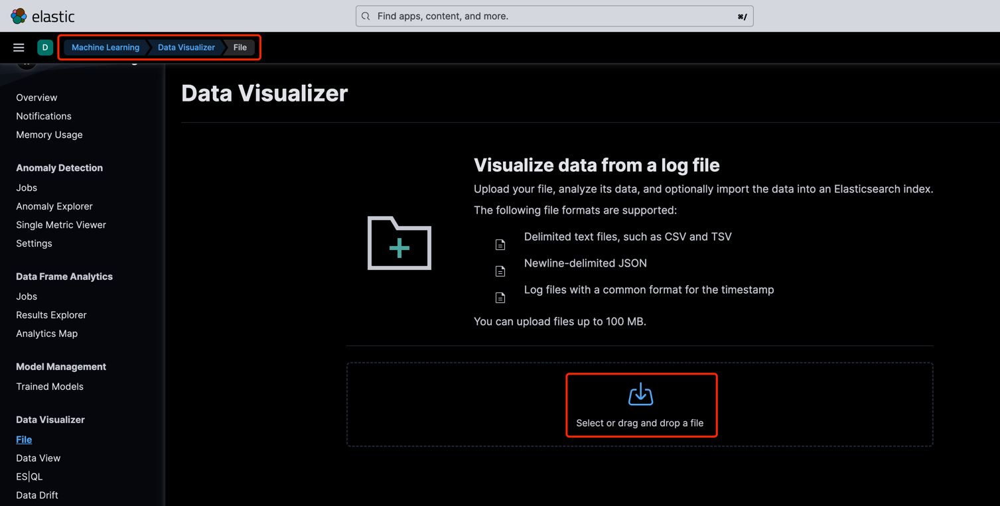
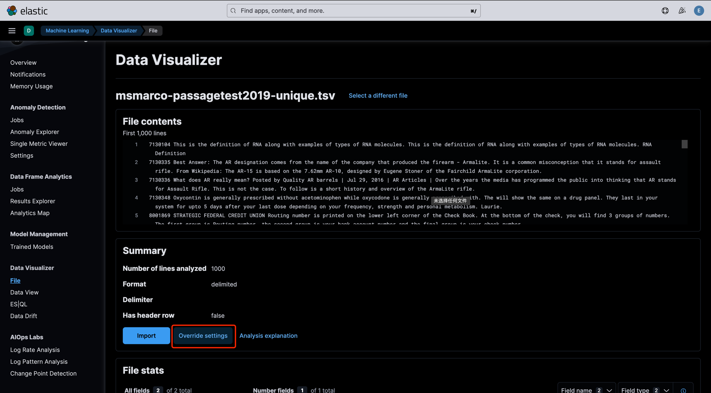
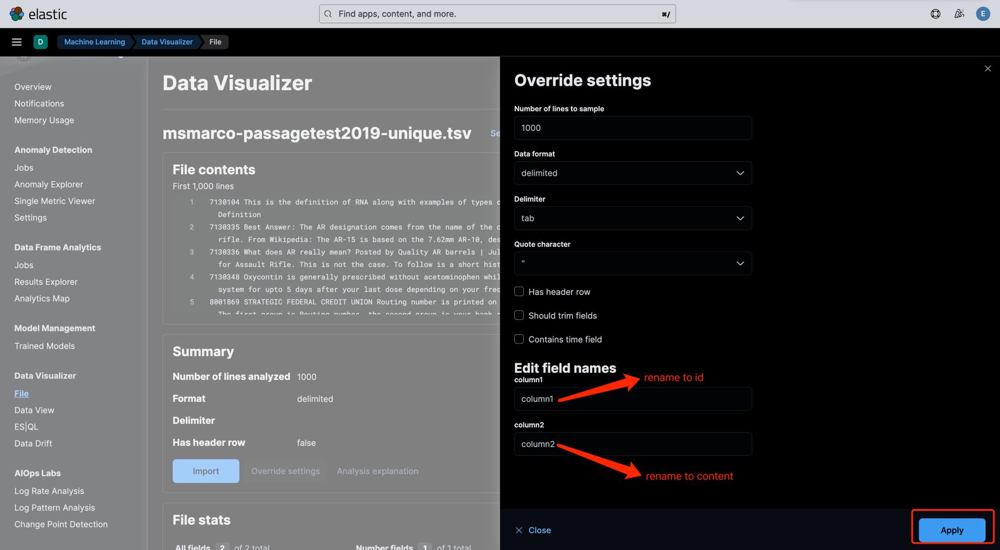
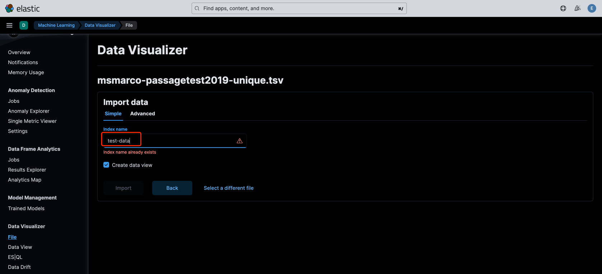
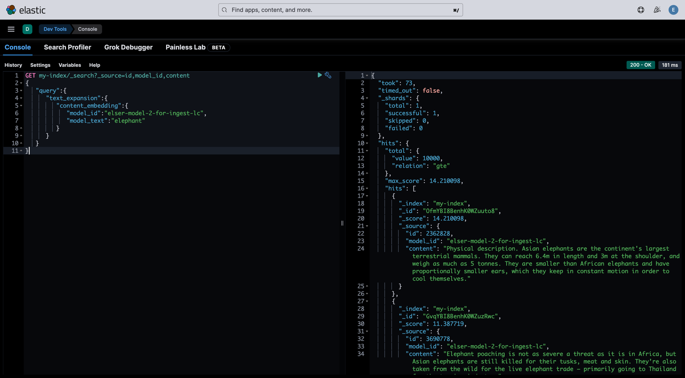

# Steps for semantic search with ELSER(使用 ELSER 进行语义搜索的步骤)
**Official reference manual**: https://www.elastic.co/guide/en/elasticsearch/reference/current/semantic-search-elser.html

1. Download and deploy ELSER(**docker run es-standalone with -m 4G**): https://www.elastic.co/guide/en/machine-learning/8.13/ml-nlp-elser.html#download-deploy-elser
2. Create the index mapping
```
PUT my-index
{
    "mappings": {
        "properties": {
            "content_embedding": {
                "type": "sparse_vector"
            },
            "content": {
                "type": "text"
            }
        }
    }
}
```
3. Create an ingest pipeline with an inference processor
```
PUT _ingest/pipeline/elser-v2-lc-test
{
    "processors": [
        {
            "inference": {
                "model_id": "elser-model-2-for-ingest-lc",
                "input_output": [
                    {
                        "input_field": "content",
                        "output_field": "content_embedding"
                    }
                ]
            }
        }
    ]
}
```
4. Load data
<br />
tsv file: https://github.com/elastic/stack-docs/blob/main/docs/en/stack/ml/nlp/data/msmarco-passagetest2019-unique.tsv

- 4.1 Select file and upload

- 4.2 Rename column


- 4.3 Import and named index

5. Reindex test-data to my-index
```
POST _reindex?wait_for_completion=false
{
    "source": {
        "index": "test-data",
        "size": 50
    },
    "dest": {
        "index": "my-index",
        "pipeline": "elser-v2-lc-test"
    }
}
```
6. Semantic search by using the text_expansion query
```
GET my-index/_search?_source=id,model_id,content
{
    "query": {
        "text_expansion": {
            "content_embedding": {
                "model_id": "elser-model-2-for-ingest-lc",
                "model_text": "elephant"
            }
        }
    }
}
```

